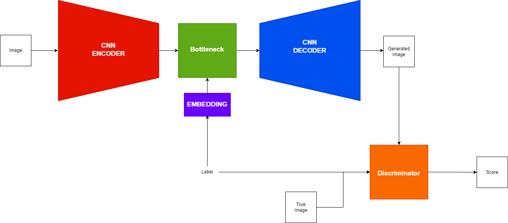
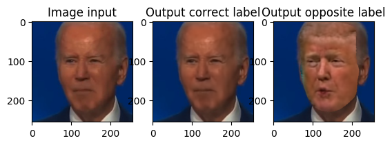
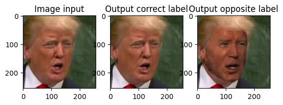

# DeepFaceLab - CGANs in Pytorch

This repo contains the work made by my fellow schoolmates and I (Thomas Crasson). It relies on the Deep Face Lab repo. The goal of this repo is to change the code of Deep Face Lab from tensorflow to pytorch. We also changed the model used by Deep Face Lab.

The repo Deep Face Lab is available at:https://github.com/iperov/DeepFaceLab.git

Deep Face Lab's model was made of 1 encoder and 2 decoders. Each encoder was trained to decode a specific face. We use in our example the faces of Joe Biden and Donald Trump.

The goal of this repository is to place the face of Donald Trump on Joe Biden and vice versa.

We have changed this model to only train one generator. We use a Conditional GAN to do so.

# CGAN

Our model is made of an auto-encoder as genarator. We give the information of either it is Trump or Biden by adding an embedding to the bottleneck.

Our bottleneck is either a MLP or a cross-attention model. In order to use one or the other, one has to use cgan_att.py or cgan.py.  
 Both encoder and decoder are CNN. The discriminator is made of one convolutionnal layer and a MLP. In order to train the generator, we use a weighted sum of the discriminator score and the dissimilarity between the input and the ouput of the generator. Hence, the generator learns to generate realistic images thanks to both losses. 

In order to increase the training and to focus on faces and not background, we use masks to compute losses only on the faces of the images as shown below.

After training, we simply change the label given to the generator. We given the images of Donal Trump with the class of Joe Biden.

We can see that the reconstruction between the background and the new faces are somewhat not good enough. Hopefully, the rest of the pipeline of Deep Face Lab solves this kind of artefacts to give a way better result. Please refert to the Deep Face Lab repo to check this part.